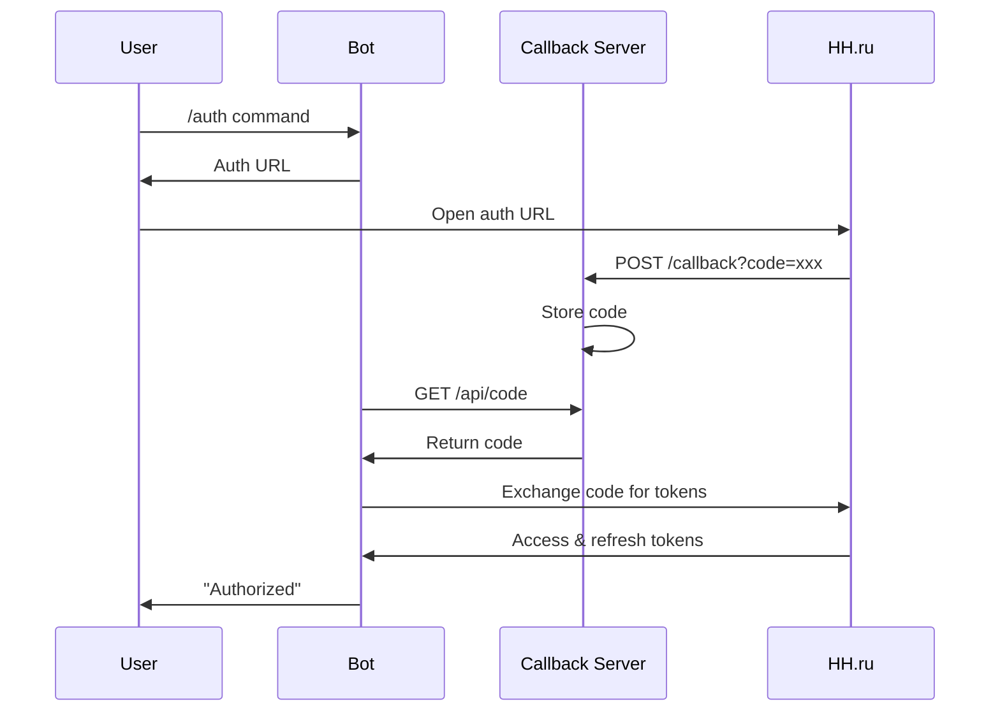

# 🔌 API Документация

Техническая документация по внутренним API и интерфейсам AI Resume Assistant Bot.

## 📋 Обзор API

Система содержит следующие основные API компоненты:

- **🤖 Telegram Bot API** — интерфейс с пользователями
- **🔐 OAuth Callback API** — обработка авторизации HH.ru
- **🏢 HeadHunter API Client** — интеграция с hh.ru
- **🧠 LLM Services API** — AI-сервисы для анализа
- **📄 PDF Generator API** — создание отчетов

## 🔐 OAuth Callback API

### Базовый URL
```
http://localhost:8080
```

### Endpoints

#### `GET /callback`
Обработка OAuth callback от HH.ru

**Параметры:**
- `code` (string, required) — код авторизации от HH.ru

**Ответы:**
```http
HTTP/1.1 200 OK
Content-Type: text/html

Авторизация успешно завершена. Вы можете закрыть это окно и вернуться в бот.
```

**Ошибки:**
```http
HTTP/1.1 400 Bad Request
Content-Type: text/html

Ошибка авторизации. Пожалуйста, попробуйте снова.
```

#### `GET /api/code`
Получение сохраненного кода авторизации

**Ответы:**
```json
{
  "code": "authorization_code_string"
}
```

**Ошибки:**
```json
HTTP/1.1 404 Not Found
{
  "code": null
}
```

#### `POST /api/reset_code`
Сброс кода авторизации

**Ответы:**
```json
{
  "status": "success"
}
```

## 🏢 HeadHunter API Client

### Класс: `HHApiClient`

```python
class HHApiClient:
    def __init__(self, access_token: str, refresh_token: str)
    
    async def request(
        self, 
        endpoint: str, 
        method: str = 'GET', 
        data: Optional[Dict] = None, 
        params: Optional[Dict] = None
    ) -> Dict[str, Any]
```

#### Методы

##### `request(endpoint, method, data, params)`
Выполнение HTTP запроса к HH.ru API

**Параметры:**
- `endpoint` (str) — путь к API endpoint (например, 'resumes/12345')
- `method` (str) — HTTP метод ('GET', 'POST', 'PUT', 'DELETE')
- `data` (dict, optional) — данные для POST/PUT запросов
- `params` (dict, optional) — параметры запроса

**Возвращает:**
- `Dict[str, Any]` — ответ от API в формате JSON

**Исключения:**
- `ValueError` — при отсутствии access_token
- `Exception` — при ошибках API (статус >= 400)

**Пример использования:**
```python
client = HHApiClient(access_token, refresh_token)

# Получение резюме
resume = await client.request('resumes/12345678')

# Получение вакансии
vacancy = await client.request('vacancies/98765432')

# Поиск вакансий
results = await client.request('vacancies', params={
    'text': 'Python разработчик',
    'area': 1  # Москва
})
```

### Автоматическое обновление токенов

Клиент автоматически обновляет истекшие токены:

```python
# При получении 401 ошибки:
if response.status == 401:
    tokens = await self.token_refresher.refresh()
    self.access_token = tokens.get('access_token')
    self.refresh_token = tokens.get('refresh_token')
    # Повторный запрос с новым токеном
```

## 🧠 LLM Services API

### GAP Analyzer

#### Класс: `LLMGapAnalyzer`

```python
class LLMGapAnalyzer:
    async def gap_analysis(
        self, 
        parsed_resume: Dict[str, Any], 
        parsed_vacancy: Dict[str, Any]
    ) -> Optional[ResumeTailoringAnalysis]
```

**Параметры:**
- `parsed_resume` — структурированные данные резюме
- `parsed_vacancy` — структурированные данные вакансии

**Возвращает:**
- `ResumeTailoringAnalysis` — результат анализа или None при ошибке

**Модель ответа:**
```python
class ResumeTailoringAnalysis(BaseModel):
    suggested_resume_title: str
    suggested_skills_description_for_rewriter: str
    suggested_skill_set_for_rewriter: List[str]
    experience_reports: List[ExperienceRecommendationsReport]
```

### Cover Letter Generator

#### Класс: `LLMCoverLetterGenerator`

```python
class LLMCoverLetterGenerator:
    async def generate_cover_letter(
        self,
        parsed_resume: Dict[str, Any],
        parsed_vacancy: Dict[str, Any]
    ) -> Optional[CoverLetter]
```

**Модель ответа:**
```python
class CoverLetter(BaseModel):
    subject_line: str
    greeting: str
    opening_paragraph: str
    body_paragraphs: str
    closing_paragraph: str
    signature: str
```

### Interview Checklist Generator

#### Класс: `LLMInterviewChecklistGenerator`

```python
class LLMInterviewChecklistGenerator:
    async def generate_interview_checklist(
        self,
        parsed_resume: Dict[str, Any],
        parsed_vacancy: Dict[str, Any]
    ) -> Optional[InterviewChecklist]
```

**Модель ответа:**
```python
class InterviewChecklist(BaseModel):
    position_title: str
    preparation_overview: str
    estimated_preparation_time: str
    technical_skills: List[TechnicalSkill]
    theory_topics: List[TheoryTopic]
    practical_tasks: List[PracticalTask]
    behavioral_questions: List[BehavioralQuestion]
    company_research_tips: str
    final_recommendations: str
```

### Interview Simulator

#### Класс: `LLMInterviewSimulator`

```python
class LLMInterviewSimulator:
    async def simulate_interview(
        self,
        parsed_resume: Dict[str, Any],
        parsed_vacancy: Dict[str, Any]
    ) -> Optional[InterviewSimulation]
```

**Модель ответа:**
```python
class InterviewSimulation(BaseModel):
    position_title: str
    candidate_name: str
    company_context: str
    dialog_messages: List[DialogMessage]
    hr_assessment: str
    candidate_performance_analysis: str
    improvement_recommendations: str
    simulation_metadata: dict
```

## 📄 PDF Generator API

### Класс: `InterviewSimulationPDFGenerator`

```python
class InterviewSimulationPDFGenerator:
    def generate_pdf(self, simulation: InterviewSimulation) -> Optional[BytesIO]
    def generate_filename(self, simulation: InterviewSimulation) -> str
```

#### `generate_pdf(simulation)`
Создание PDF документа симуляции интервью

**Параметры:**
- `simulation` — объект InterviewSimulation

**Возвращает:**
- `BytesIO` — PDF документ в виде байтов или None при ошибке

#### `generate_filename(simulation)`
Генерация имени файла для PDF

**Возвращает:**
- `str` — имя файла в формате `interview_simulation_Position_Title_YYYYMMDD_HHMMSS.pdf`

## 🗄️ Data Models API

### Resume Models

```python
class ResumeInfo(BaseModel):
    title: str
    skills: str
    skill_set: List[str]
    experience: List[Experience]
    employments: List[str]
    schedules: List[str]
    languages: List[Language]
    relocation: Optional[Relocation]
    salary: Optional[Salary]
    professional_roles: List[ProfessionalRole]

class Experience(BaseModel):
    description: str
    position: str
    start: Optional[str]
    end: Optional[str]
```

### Vacancy Models

```python
class VacancyInfo(BaseModel):
    description: str
    key_skills: List[str]
    employment_form: Optional[EmploymentForm]
    experience: Optional[ExperienceVac]
    schedule: Optional[Schedule]
    employment: Optional[Employment]
```

### LLM Response Models

Все LLM сервисы возвращают структурированные Pydantic модели:

- `ResumeTailoringAnalysis` — GAP анализ
- `CoverLetter` — рекомендательное письмо
- `InterviewChecklist` — чек-лист подготовки
- `InterviewSimulation` — симуляция интервью

## ⚙️ Parsers API

### Resume Extractor

```python
class ResumeExtractor:
    def extract_resume_info(self, data: Dict[str, Any]) -> Optional[ResumeInfo]
```

**Функциональность:**
- Извлечение структурированных данных из HH API
- Очистка HTML тегов
- Валидация через Pydantic модели

### Vacancy Extractor

```python
class VacancyExtractor:
    def extract_vacancy_info(self, data: Dict[str, Any]) -> Optional[VacancyInfo]
```

## 🔄 State Management API

### Telegram Bot FSM

Система использует aiogram FSM для управления состояниями пользователей:

```python
class UserState(StatesGroup):
    INITIAL = State()
    UNAUTHORIZED = State()
    AUTH_WAITING = State()
    AUTHORIZED = State()
    RESUME_PREPARATION = State()
    VACANCY_PREPARATION = State()
    RESUME_GAP_ANALYZE = State()
    COVER_LETTER_GENERATION = State()
    INTERVIEW_CHECKLIST_GENERATION = State()
    INTERVIEW_SIMULATION_GENERATION = State()
```

### Структура данных состояния

```python
user_state_data = {
    'access_token': str,
    'refresh_token': str,
    'expires_in': int,
    'resume_link': str,
    'resume_id': str,
    'resume_data': dict,
    'parsed_resume': dict,
    'vacancy_link': str,
    'vacancy_id': str,
    'vacancy_data': dict,
    'parsed_vacancy': dict,
    'gap_analysis': dict,
    'cover_letter': dict,
    'interview_checklist': dict,
    'interview_simulation': dict
}
```

## 🔐 Authentication Flow API

### OAuth 2.0 Flow



### Token Management

```python
class HHTokenManager:
    async def get_valid_tokens(self) -> Tuple[str, str]
    
class HHTokenRefresher:
    async def refresh(self) -> Dict[str, str]
```

## 📊 Error Handling

### Стандартные ошибки

```python
# LLM Services
class LLMServiceError(Exception):
    """Базовая ошибка LLM сервисов"""
    pass

class ValidationError(LLMServiceError):
    """Ошибка валидации данных"""
    pass

# HH API
class HHAPIError(Exception):
    """Ошибка HeadHunter API"""
    pass

class TokenExpiredError(HHAPIError):
    """Истекший токен"""
    pass
```

### Обработка ошибок

```python
try:
    result = await llm_service.process(data)
except ValidationError as e:
    logger.error(f"Validation error: {e}")
    return None
except LLMServiceError as e:
    logger.error(f"LLM service error: {e}")
    return None
```

## 🧪 Testing API

### Тестирование LLM сервисов

```python
# Пример теста
async def test_gap_analysis():
    analyzer = LLMGapAnalyzer()
    
    # Тестовые данные
    resume_data = {...}
    vacancy_data = {...}
    
    # Выполнение анализа
    result = await analyzer.gap_analysis(resume_data, vacancy_data)
    
    # Проверки
    assert result is not None
    assert isinstance(result, ResumeTailoringAnalysis)
    assert len(result.experience_reports) > 0
```

### Mock объекты

```python
# Mock для OpenAI API
class MockOpenAI:
    async def chat_completions_create(self, **kwargs):
        return MockResponse(test_response_data)

# Mock для HH API
class MockHHClient:
    async def request(self, endpoint):
        return test_data[endpoint]
```

## 📈 Performance API

### Метрики производительности

```python
# Логирование времени выполнения
import time
from functools import wraps

def measure_time(func):
    @wraps(func)
    async def wrapper(*args, **kwargs):
        start = time.time()
        result = await func(*args, **kwargs)
        duration = time.time() - start
        logger.info(f"{func.__name__} took {duration:.2f}s")
        return result
    return wrapper

@measure_time
async def gap_analysis(self, resume, vacancy):
    # Implementation
```

### Rate Limiting

```python
# Ограничение запросов к OpenAI
import asyncio
from asyncio import Semaphore

class RateLimiter:
    def __init__(self, max_concurrent=5):
        self.semaphore = Semaphore(max_concurrent)
    
    async def __aenter__(self):
        await self.semaphore.acquire()
    
    async def __aexit__(self, *args):
        self.semaphore.release()
```

## 🔌 Webhook API (опционально)

### Telegram Webhook

```python
# Для продакшн развертывания
@app.post("/webhook")
async def telegram_webhook(request: Request):
    update = Update.model_validate(await request.json())
    await dp.process_update(update)
    return {"status": "ok"}
```

### HH.ru Webhook

```python
# Для уведомлений о изменениях
@app.post("/hh-webhook")
async def hh_webhook(request: Request):
    data = await request.json()
    # Обработка уведомлений от HH.ru
    return {"status": "received"}
```

---

📚 **Эта документация покрывает все основные API компоненты системы.**

Для получения более подробной информации о конкретных методах, обратитесь к исходному коду или используйте интроспекцию Python:

```python
help(LLMGapAnalyzer.gap_analysis)
```