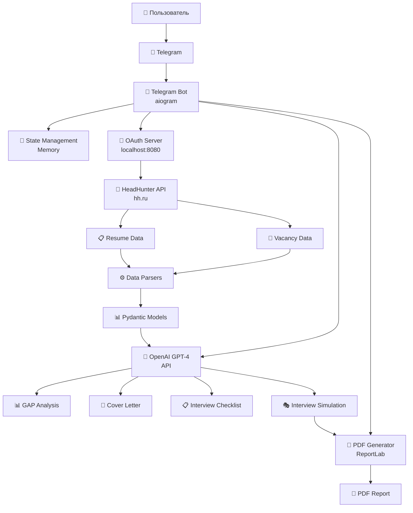
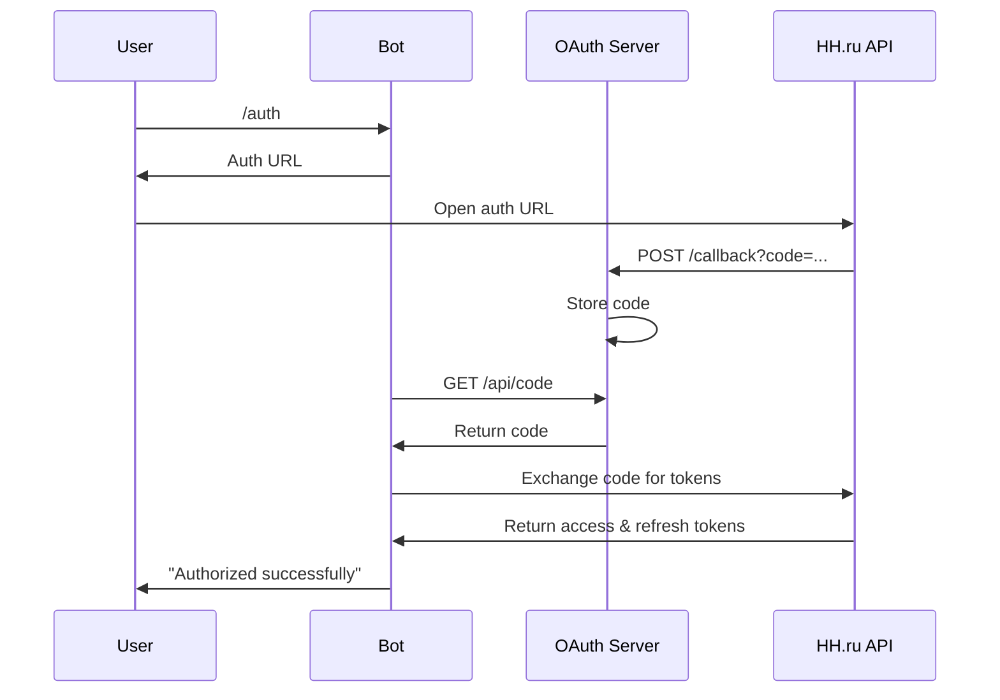
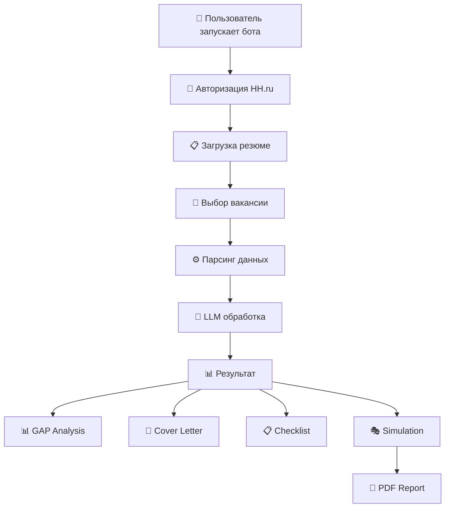
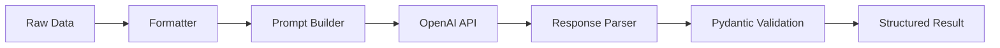
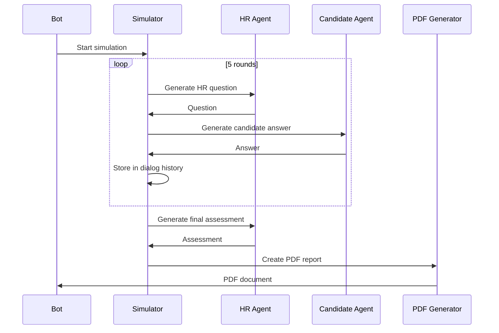
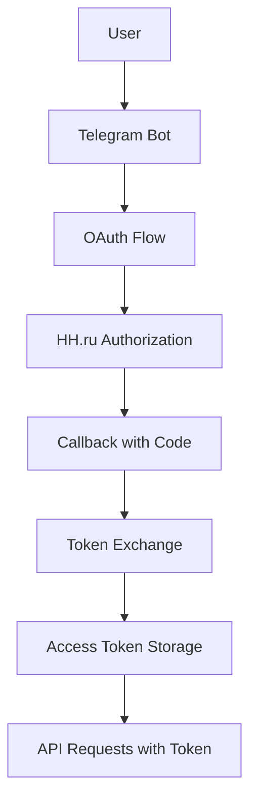
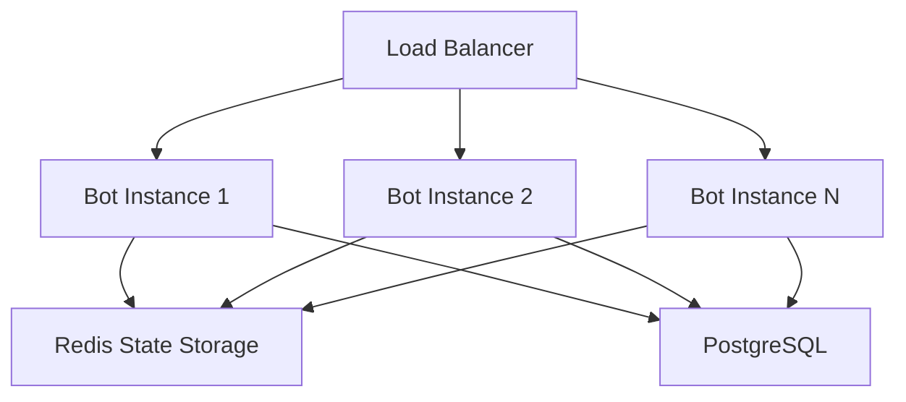

# 🏗️ Архитектура системы

Техническое описание архитектуры AI Resume Assistant Bot, компонентов системы и их взаимодействия.

## 📐 Общая архитектура

### Высокоуровневая схема



### Компоненты системы

| Компонент | Назначение | Технология |
|-----------|------------|------------|
| **Telegram Bot** | Интерфейс пользователя | aiogram 3.x |
| **OAuth Server** | Авторизация HH.ru | aiohttp + FastAPI |
| **Data Parsers** | Обработка данных | Pydantic |
| **LLM Services** | AI-анализ и генерация | OpenAI GPT-4 |
| **PDF Generator** | Создание отчетов | ReportLab |
| **State Manager** | Управление состоянием | aiogram FSM |

## 🔧 Детальная архитектура модулей

### 1. Telegram Bot (`src/tg_bot/`)

```
src/tg_bot/
├── bot/
│   ├── __init__.py
│   ├── config.py          # Конфигурация бота
│   └── instance.py        # Экземпляр бота и диспетчера
├── handlers/
│   ├── command_handlers.py    # Обработчики команд (/start, /auth)
│   ├── message_handlers.py    # Обработчики сообщений
│   ├── router.py              # Маршрутизация обработчиков
│   └── spec_handlers/         # Специализированные обработчики
│       ├── auth_handler.py            # Авторизация
│       ├── cover_letter_handler.py    # Cover letter
│       ├── gap_analyzer_handler.py    # GAP-анализ
│       ├── interview_checklist_handler.py  # Чек-листы
│       ├── interview_simulation_handler.py # Симуляция
│       ├── resume_handler.py          # Обработка резюме
│       └── vacancy_handler.py         # Обработка вакансий
├── utils/
│   ├── keyboards.py       # Клавиатуры Telegram
│   ├── states.py          # Состояния FSM
│   └── text_constants.py  # Текстовые константы
└── main.py               # Точка входа
```

#### Состояния FSM

```python
class UserState(StatesGroup):
    INITIAL = State()                           # Начальное состояние
    UNAUTHORIZED = State()                      # Не авторизован
    AUTH_WAITING = State()                      # Ожидание авторизации
    AUTHORIZED = State()                        # Авторизован
    RESUME_PREPARATION = State()                # Подготовка резюме
    VACANCY_PREPARATION = State()               # Подготовка вакансии
    RESUME_GAP_ANALYZE = State()               # GAP-анализ
    COVER_LETTER_GENERATION = State()          # Генерация письма
    INTERVIEW_CHECKLIST_GENERATION = State()   # Генерация чек-листа
    INTERVIEW_SIMULATION_GENERATION = State()  # Симуляция интервью
```

### 2. OAuth Server (`src/callback_local_server/`)

```
src/callback_local_server/
├── __init__.py
├── config.py        # Конфигурация сервера
├── main.py          # Запуск сервера
└── server.py        # FastAPI endpoints
```

#### Endpoints

- `GET /callback` — OAuth callback от HH.ru
- `GET /api/code` — Получение кода авторизации
- `POST /api/reset_code` — Сброс кода авторизации

### 3. HeadHunter Integration (`src/hh/`)

```
src/hh/
├── __init__.py
├── api_client.py        # HTTP клиент для HH API
├── auth.py              # Сервис авторизации
├── config.py            # Конфигурация HH
├── token_exchanger.py   # Обмен кода на токены
├── token_manager.py     # Управление токенами
└── token_refresher.py   # Обновление токенов
```

#### Поток авторизации



### 4. LLM Services

#### GAP Analyzer (`src/llm_gap_analyzer/`)

```
src/llm_gap_analyzer/
├── __init__.py
├── config.py               # OpenAI конфигурация
├── formatter.py            # Форматирование данных
└── llm_gap_analyzer.py     # Основная логика
```

**Функциональность:**
- Анализ соответствия резюме вакансии
- Генерация рекомендаций по улучшению
- Структурированный вывод через Pydantic

#### Cover Letter Generator (`src/llm_cover_letter/`)

```
src/llm_cover_letter/
├── __init__.py
├── config.py                      # OpenAI конфигурация
├── formatter.py                   # Форматирование данных
└── llm_cover_letter_generator.py  # Генерация писем
```

**Функциональность:**
- Персонализированные cover letter
- Структурированный формат письма
- Профессиональный стиль изложения

#### Interview Checklist (`src/llm_interview_checklist/`)

```
src/llm_interview_checklist/
├── __init__.py
├── config.py                          # OpenAI конфигурация
├── formatter.py                       # Форматирование данных
└── llm_interview_checklist_generator.py # Генерация чек-листов
```

**Функциональность:**
- Персонализированные планы подготовки
- Конкретные ресурсы и временные рамки
- Приоритизация навыков

#### Interview Simulation (`src/llm_interview_simulation/`)

```
src/llm_interview_simulation/
├── __init__.py
├── config.py                      # OpenAI конфигурация
├── formatter.py                   # Форматирование данных
├── llm_interview_simulator.py     # Симуляция диалога
└── pdf_generator.py               # Генерация PDF
```

**Функциональность:**
- Диалог между HR и кандидатом
- 5 раундов вопросов-ответов
- PDF отчет с анализом

### 5. Data Models (`src/models/`)

```
src/models/
├── __init__.py
├── cover_letter_models.py      # Модели cover letter
├── gap_analysis_models.py      # Модели GAP-анализа
├── interview_checklist_models.py # Модели чек-листов
├── interview_simulation_models.py # Модели симуляции
├── resume_models.py            # Модели резюме
├── resume_update_models.py     # Модели обновления резюме
└── vacancy_models.py           # Модели вакансий
```

#### Пример модели GAP-анализа

```python
class ResumeTailoringAnalysis(BaseModel):
    suggested_resume_title: str
    suggested_skills_description_for_rewriter: str
    suggested_skill_set_for_rewriter: List[str]
    experience_reports: List[ExperienceRecommendationsReport]
    
    class Config:
        extra = "forbid"
```

### 6. Data Parsers (`src/parsers/`)

```
src/parsers/
├── __init__.py
├── resume_extractor.py    # Парсер резюме
└── vacancy_extractor.py   # Парсер вакансий
```

**Функциональность:**
- Извлечение структурированных данных из HH API
- Валидация через Pydantic модели
- Обработка ошибок и исключений

## 🔄 Потоки данных

### 1. Основной поток работы



### 2. Поток обработки LLM



### 3. Поток симуляции интервью



## 🗄️ Управление данными

### State Management

Система использует **in-memory state** через aiogram FSM:

```python
# Структура состояния пользователя
user_state = {
    'access_token': str,
    'refresh_token': str,
    'expires_in': int,
    'resume_link': str,
    'resume_id': str,
    'resume_data': dict,
    'parsed_resume': dict,
    'vacancy_link': str,
    'vacancy_id': str,
    'vacancy_data': dict,
    'parsed_vacancy': dict,
    'gap_analysis': dict,
    'cover_letter': dict,
    'interview_checklist': dict,
    'interview_simulation': dict
}
```

### Data Flow Security

- ✅ **OAuth токены** — временное хранение в памяти
- ✅ **Пользовательские данные** — не сохраняются на диск
- ✅ **API ключи** — через переменные окружения
- ✅ **Логирование** — без персональных данных

## 🔧 Конфигурация

### Структура конфигурации

```python
# Базовая конфигурация
class BaseAppSettings(BaseSettings):
    app_name: str = "Resume Bot"
    debug: bool = False

# Специфичные конфигурации
class TelegramBotSettings(BaseAppSettings):
    bot_token: str
    
class HHSettings(BaseAppSettings):
    client_id: str
    client_secret: str
    redirect_uri: str
    
class OpenAIConfig(BaseAppSettings):
    api_key: str
    model_name: str
```

### Переменные окружения

```env
# Telegram
TG_BOT_BOT_TOKEN=...

# OpenAI
OPENAI_API_KEY=...
OPENAI_MODEL_NAME=gpt-4

# HeadHunter
HH_CLIENT_ID=...
HH_CLIENT_SECRET=...
HH_REDIRECT_URI=http://localhost:8080/callback

# Callback Server
CALLBACK_LOCAL_HOST=0.0.0.0
CALLBACK_LOCAL_PORT=8080
```

## 🔄 Жизненный цикл компонентов

### Telegram Bot

```python
async def main():
    # 1. Инициализация
    dp = Dispatcher(storage=MemoryStorage())
    bot = Bot(token=settings.bot_token)
    
    # 2. Регистрация обработчиков
    register_handlers(dp)
    
    # 3. Запуск polling
    await dp.start_polling(bot)
```

### OAuth Server

```python
def start_server():
    # 1. Создание FastAPI app
    app = FastAPI(title="callback_local_server")
    
    # 2. Регистрация endpoints
    @app.get("/callback")
    async def callback_handler(code: str = Query(None)):
        # Обработка OAuth callback
    
    # 3. Запуск uvicorn
    uvicorn.run(app, host=settings.host, port=settings.port)
```

### LLM Services

```python
class LLMService:
    def __init__(self):
        self.client = OpenAI(api_key=settings.api_key)
    
    async def process(self, data):
        # 1. Форматирование данных
        prompt = self._format_data(data)
        
        # 2. Вызов OpenAI API
        response = await self.client.chat.completions.create(...)
        
        # 3. Валидация ответа
        result = ResponseModel.model_validate_json(response)
        
        return result
```

## 📊 Мониторинг и логирование

### Структура логов

```
LOGS/
├── tg_bot.log                     # Telegram bot
├── callback_local_server.log      # OAuth сервер  
├── hh.log                         # HeadHunter API
├── llm_gap_analyzer.log           # GAP анализатор
├── llm_cover_letter.log           # Cover letter генератор
├── llm_interview_checklist.log    # Чек-листы
├── llm_interview_simulation.log   # Симуляция интервью
├── parsers.log                    # Парсеры данных
└── legacy/
```

### Метрики

Система логирует следующие метрики:
- 📈 **Количество пользователей** по состояниям
- ⏱️ **Время обработки** LLM запросов
- 🔄 **Количество API вызовов** к HH.ru и OpenAI
- ❌ **Ошибки** и их частота
- 📊 **Использование функций** (какие функции популярнее)

## 🔐 Безопасность

### Авторизация и аутентификация



### Защита данных

- **Токены** — хранятся только в памяти
- **API ключи** — только через переменные окружения
- **Персональные данные** — не сохраняются постоянно
- **Логи** — без чувствительной информации

## 🚀 Масштабирование

### Горизонтальное масштабирование



### Возможные улучшения архитектуры

1. **Database Layer**
   - PostgreSQL для постоянного хранения
   - Redis для кэширования и состояний

2. **Message Queue**
   - Celery для асинхронных задач
   - RabbitMQ/Redis как брокер

3. **Microservices**
   - Разделение LLM сервисов на отдельные микросервисы
   - API Gateway для маршрутизации

4. **Monitoring**
   - Prometheus + Grafana для метрик
   - ELK Stack для логов
   - Sentry для отслеживания ошибок

---

📊 **Эта архитектура обеспечивает:**
- ✅ Модульность и расширяемость
- ✅ Безопасность и приватность
- ✅ Производительность и надежность
- ✅ Простоту разработки и поддержки