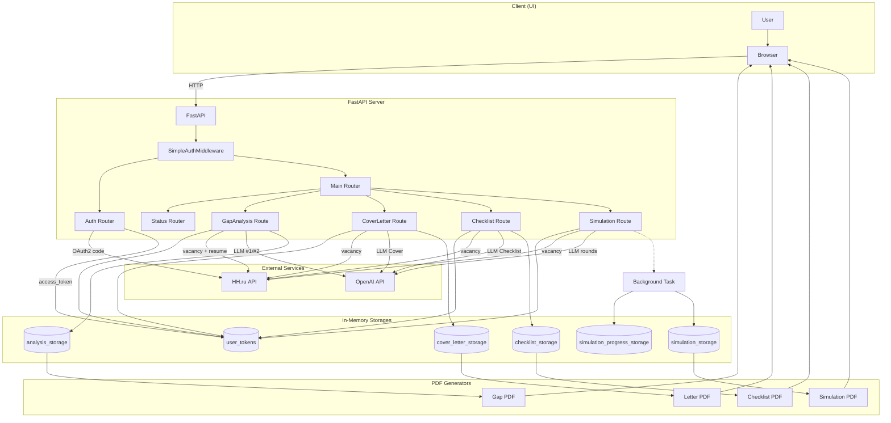

# AI Resume Assistant - Web App Workflow

## 1. Запуск приложения

*   **Точка входа:** Пользователь запускает скрипт `run_unified_app.py`.
    *   **Файл:** `run_unified_app.py`
    *   **Действие:** Скрипт импортирует и запускает `uvicorn` для асинхронного веб-сервера.
    *   **Ключевая строка:** `uvicorn.run(app, host="0.0.0.0", port=3000)`
    *   **Зависимость:** Переменная `app` импортируется из `src.web_app.unified_app.main`.

*   **Инициализация FastAPI:**
    *   **Файл:** `src/web_app/unified_app/main.py`
    *   **Действие:** Создается экземпляр `FastAPI`, настраиваются маршруты (роутеры) и статические файлы.
    *   **Ключевые моменты:**
        *   `app = FastAPI()`: Создание основного объекта приложения.
        *   `app.mount("/static", ...)`: Подключение папки со статическими файлами (CSS, JS).
        *   `app.include_router(auth_router)`: Подключение роутера для аутентификации из `src.security.auth`.
        *   `app.include_router(main_router)`: Подключение основного роутера с главными страницами и функциями приложения.
        *   `app.include_router(status_router)`: Подключение роутера для страницы мониторинга состояния системы.

## 2. Аутентификация пользователя

*   **Инициация:** Пользователь, не имеющий активной сессии, пытается зайти на любую страницу, кроме исключений (`/login`, `/static`, etc.).
    *   **Компонент:** `SimpleAuthMiddleware` (Middleware)
    *   **Файл:** `src/security/auth.py`
    *   **Логика:** Middleware перехватывает запрос. `session_manager.validate_session()` возвращает `False`.
    *   **Результат:** Пользователь перенаправляется на `/login` с параметром `redirect`, указывающим на исходную страницу. `RedirectResponse(url="/login?redirect=...", status_code=302)`.

*   **Отображение формы входа:**
    *   **Маршрут:** `GET /login`
    *   **Функция:** `login_page(request: Request)`
    *   **Файл:** `src/security/auth.py`
    *   **Действие:** Возвращает HTML-страницу, сгенерированную из шаблона `login.html`.

*   **Отправка формы входа:**
    *   **Маршрут:** `POST /login`
    *   **Функция:** `login_post(request: Request, password: str = Form(...))`
    *   **Файл:** `src/security/auth.py`
    *   **Логика:**
        1.  Пароль из формы (`password`) сравнивается со значением из `os.getenv("DEMO_PASSWORD", "demo2025")`.
        2.  В случае успеха, вызывается `session_manager.create_session()` для создания нового ID сессии.
        3.  Создается `RedirectResponse` для перенаправления пользователя на исходно запрошенную страницу (или на `/` по умолчанию).
    *   **Результат:** В cookie браузера устанавливается `auth_session` с ID сессии. `response.set_cookie(...)`.

*   **Проверка сессии:**
    *   **Компонент:** `SimpleAuthMiddleware`
    *   **Действие:** При последующих запросах middleware снова проверяет cookie. `session_manager.validate_session(session_id)` на этот раз возвращает `True`, и запрос передается дальше в приложение.

## 3. Главная страница и навигация

*   **Вход на главную страницу:** После успешной аутентификации пользователь попадает на главную страницу.
    *   **Маршрут:** `GET /`
    *   **Функция:** `index(request: Request, _: bool = Depends(auth_system.require_auth))`
    *   **Файл:** `src/web_app/unified_app/main.py`
    *   **Зависимость:** `auth_system.require_auth` проверяет наличие валидной сессии перед выполнением функции.
    *   **Действие:** Возвращает HTML-страницу, сгенерированную из шаблона `index.html`. Этот шаблон содержит основную навигацию по четырем функциям приложения.

*   **Переход к функциям:** Пользователь нажимает на одну из ссылок на главной странице.
    *   **Маршруты:**
        *   `GET /gap-analysis`
        *   `GET /cover-letter`
        *   `GET /interview-checklist`
        *   `GET /interview-simulation`
    *   **Функции:**
        *   `gap_analysis_page(...)`
        *   `cover_letter_page(...)`
        *   `interview_checklist_page(...)`
        *   `interview_simulation_page(...)`
    *   **Файл:** `src/web_app/unified_app/main.py`
    *   **Действие:** Каждая функция, защищенная `Depends(auth_system.require_auth)`, возвращает соответствующую HTML-страницу (`gap_analysis.html`, `cover_letter.html` и т.д.), которая содержит форму для ввода данных (загрузка резюме, URL вакансии).

## 4. Workflow: Авторизация на HH.ru (OAuth2)

Этот процесс необходим для получения доступа к API HH.ru и извлечения данных о вакансиях.

### Шаг 4.1: Инициация авторизации

*   **Действие пользователя:** На любой из страниц функций (например, `/gap-analysis`) пользователь нажимает кнопку **"Войти через HH.ru"**.
*   **Результат:** Фронтенд-скрипт отправляет `POST` запрос на эндпоинт `/auth/hh`.

### Шаг 4.2: Получение URL для редиректа

*   **Маршрут:** `POST /auth/hh`
*   **Функция:** `start_hh_auth(...)`
*   **Файл:** `src/web_app/unified_app/main.py`
*   **Логика:**
    1.  Вызывается `hh_auth_service.get_auth_url()`.
    2.  **Класс:** `HHAuthService` (из `src/hh/auth.py`).
    3.  **Метод:** `get_auth_url()`.
    4.  **Действие:** Формируется URL вида `https://hh.ru/oauth/authorize?response_type=code&client_id=...&redirect_uri=...`.
*   **Результат:** Сервер возвращает JSON с этим URL. Фронтенд-скрипт автоматически перенаправляет пользователя по этому адресу.

### Шаг 4.3: Авторизация на стороне HH.ru

*   **Действие пользователя:**
    1.  Пользователь видит страницу входа HH.ru, вводит свои данные.
    2.  Пользователь видит страницу с запросом разрешений для приложения и нажимает "Разрешить".
*   **Результат:** HH.ru перенаправляет браузер пользователя на `redirect_uri`, указанный в настройках (`http://localhost:8080/callback`), добавив в URL `authorization_code`.

### Шаг 4.4: Получение токенов

*   **Действие:** Фронтенд-скрипт периодически опрашивает эндпоинт `/auth/tokens`, чтобы проверить, появились ли токены.
*   **Маршрут:** `GET /auth/tokens`
*   **Функция:** `get_tokens_from_callback(...)`
*   **Файл:** `src/web_app/unified_app/main.py`
*   **Логика:**
    1.  Функция отправляет запрос на локальный callback-сервер (`http://localhost:8080/api/code`), чтобы забрать `authorization_code`, который тот получил на предыдущем шаге.
    2.  Если код получен, вызывается `token_exchanger.exchange_code(code)`.
    3.  **Класс:** `HHCodeExchanger` (из `src/hh/token_exchanger.py`).
    4.  **Метод:** `exchange_code(code)`.
    5.  **Действие:** Отправляется `POST` запрос на `https://hh.ru/oauth/token` с `authorization_code`, `client_id`, `client_secret`.
    6.  **Результат:** HH.ru возвращает `access_token` и `refresh_token`.
    7.  Токены сохраняются в глобальное хранилище `user_tokens` на сервере.
    8.  Фронтенду возвращается `{"success": True}`.

## 5. Workflow: GAP-анализ

Этот процесс описывает полный цикл от отправки данных пользователем до получения готового анализа.

### Шаг 5.1: Пользователь инициирует анализ

*   **Действие пользователя:** На странице `/gap-analysis` пользователь:
    1.  Нажимает кнопку **"Выбрать файл"**. Это стандартное действие браузера, открывающее системное окно выбора файла. Сервер на этом этапе не задействован.
    2.  Выбирает свое резюме в формате PDF.
    3.  Вставляет в текстовое поле ссылку на вакансию с сайта hh.ru.
    4.  Нажимает кнопку **"Анализировать"**.
*   **Результат:** Браузер формирует `FormData` и отправляет `POST` запрос на эндпоинт `/gap-analysis` с файлом и URL вакансии.

### Шаг 5.2: Обработка запроса на сервере

*   **Маршрут:** `POST /gap-analysis`
*   **Функция:** `perform_gap_analysis(resume_file: UploadFile, vacancy_url: str, ...)`
*   **Файл:** `src/web_app/unified_app/main.py`
*   **Последовательность выполнения:**
    1.  **Валидация и сохранение файла:** Резюме (`resume_file`) сохраняется во временный файл.
    2.  **Парсинг резюме (Вызов LLM #1):**
        *   **Класс:** `PDFResumeParser` (из `src/parsers/pdf_resume_parser.py`)
        *   **Метод:** `parse_pdf_resume(tmp_file_path)`
        *   **Внутренняя логика:**
            *   `extract_text_from_pdf()`: Извлекает сырой текст из PDF.
            *   `parse_text_to_resume()`: Отправляет извлеченный текст в **OpenAI API** (`gpt-4o-mini`) с системным промптом, который требует структурировать текст согласно Pydantic-модели `ResumeInfo`.
        *   **Результат:** Возвращается объект `ResumeInfo`.
    3.  **Извлечение ID вакансии:** Из `vacancy_url` с помощью регулярного выражения извлекается ID вакансии (например, `123456789`).
    4.  **Проверка авторизации HH.ru:**
        *   **Действие:** Система проверяет наличие `hh_access_token` во временном хранилище `user_tokens`.
        *   **Результат:** Если токен отсутствует, выбрасывается `HTTPException(400, "Необходима авторизация HH.ru")`, и процесс прерывается. Пользователь увидит сообщение об ошибке.
    5.  **Получение данных вакансии (API-вызов):**
        *   **Класс:** `HHApiClient` (из `src/hh/api_client.py`)
        *   **Метод:** `request(f'vacancies/{vacancy_id}')`
        *   **Действие:** Отправляется `GET` запрос к `https://api.hh.ru/vacancies/{id}` с `Authorization: Bearer {access_token}`. Если токен истек, он автоматически обновляется.
    6.  **Парсинг вакансии:**
        *   **Класс:** `VacancyExtractor` (из `src/parsers/vacancy_extractor.py`)
        *   **Метод:** `extract_vacancy_info(vacancy_data)`
        *   **Действие:** Из ответа API извлекается структурированная информация. Возвращается объект `VacancyInfo`.
    7.  **Выполнение GAP-анализа (Вызов LLM #2):**
        *   **Класс:** `LLMGapAnalyzer` (из `src/llm_gap_analyzer/llm_gap_analyzer.py`)
        *   **Метод:** `gap_analysis(resume_dict, vacancy_dict)`
        *   **Внутренняя логика:**
            *   `_create_system_prompt()` и `_create_user_prompt()`: Формируются детальные промпты для LLM.
            *   `client.beta.chat.completions.parse()`: Данные резюме и вакансии передаются в **OpenAI API** (`gpt-4o-mini`) для глубокого анализа соответствия. Модель получает инструкцию вернуть результат в формате Pydantic-модели `EnhancedResumeTailoringAnalysis`.
    8.  **Сохранение результата:** Результат анализа сохраняется во временное хранилище `analysis_storage` под уникальным `analysis_id`.
    9.  **Ответ браузеру:** Сервер возвращает `JSONResponse` со статусом `success` и `analysis_id`. Фронтенд-скрипт на странице использует этот ID для отображения кнопки скачивания.

### Шаг 5.3: Пользователь скачивает PDF-отчет

*   **Действие пользователя:** После успешного анализа на странице появляется кнопка **"Скачать PDF"**. Пользователь нажимает на нее.
*   **Результат:** Браузер отправляет `GET` запрос на эндпоинт `/download-gap-analysis/{analysis_id}`.

### Шаг 5.4: Генерация и отдача PDF-файла

*   **Маршрут:** `GET /download-gap-analysis/{analysis_id}`
*   **Функция:** `download_gap_analysis_pdf(analysis_id: str, ...)`
*   **Файл:** `src/web_app/unified_app/main.py`
*   **Последовательность выполнения:**
    1.  **Поиск результата:** Результат анализа извлекается из `analysis_storage` по `analysis_id`.
    2.  **Генерация PDF:**
        *   **Класс:** `GapAnalysisPDFGenerator` (из `src/web_app/gap_analysis/pdf_generator.py`)
        *   **Метод:** `generate_pdf(analysis_result)`
        *   **Действие:** Создает PDF-документ в памяти на основе данных анализа.
    3.  **Отправка файла:** Сервер возвращает `FileResponse`, который позволяет пользователю скачать сгенерированный PDF-отчет.

## 6. Workflow: Генерация сопроводительного письма

Этот процесс во многом повторяет GAP-анализ, но сфокусирован на создании текста письма.

### Шаг 6.1: Инициация и обработка запроса

*   **Действие пользователя:** На странице `/cover-letter` пользователь загружает PDF-резюме, вставляет URL вакансии и нажимает **"Сгенерировать"**.
*   **Маршрут:** `POST /generate-cover-letter`
*   **Функция:** `generate_cover_letter(...)`
*   **Файл:** `src/web_app/unified_app/main.py`
*   **Аналогичные шаги:** Происходят те же шаги, что и в GAP-анализе (п. 5.2, шаги 1-6): сохранение файла, парсинг резюме (`PDFResumeParser`), извлечение ID вакансии, проверка токена HH.ru, получение и парсинг данных вакансии (`HHApiClient`, `VacancyExtractor`).

### Шаг 6.2: Генерация текста письма (Ядро функции)

*   **Ключевой этап:** Вместо `LLMGapAnalyzer` вызывается генератор сопроводительных писем.
*   **Класс:** `EnhancedLLMCoverLetterGenerator` (из `src/llm_cover_letter/llm_cover_letter_generator.py`)
*   **Метод:** `generate_enhanced_cover_letter(resume_dict, vacancy_dict)`
*   **Внутренняя логика:**
    1.  `_analyze_vacancy_context()`: Определяется контекст (размер компании, тип роли) для адаптации тональности письма.
    2.  `_create_system_prompt()`: Создается очень подробный системный промпт, который инструктирует LLM действовать как HR-эксперт, персонализировать письмо, использовать конкретные достижения и следовать строгой структуре.
    3.  `client.beta.chat.completions.parse()`: Данные резюме и вакансии передаются в **OpenAI API** (`gpt-4o-mini`). Модель получает инструкцию вернуть результат в формате Pydantic-модели `EnhancedCoverLetter`.
*   **Результат:** Готовый объект `EnhancedCoverLetter`, содержащий как полный текст письма, так и его составные части и оценки качества.

### Шаг 6.3: Сохранение и скачивание PDF

*   **Сохранение:** Результат сохраняется во временное хранилище `cover_letter_storage` под уникальным `letter_id`.
*   **Скачивание:**
    *   **Действие пользователя:** Нажатие кнопки **"Скачать PDF"** на фронтенде.
    *   **Маршрут:** `GET /download-cover-letter/{letter_id}`
    *   **Функция:** `download_cover_letter_pdf(...)`
    *   **Логика:**
        1.  Результат извлекается из хранилища.
        2.  **Класс:** `CoverLetterPDFGenerator` (из `src/web_app/cover_letter/pdf_generator.py`).
        3.  **Метод:** `generate_pdf(cover_letter_result)`.
        4.  **Действие:** Создает профессионально оформленный PDF-документ с текстом письма и таблицами с его анализом.
        5.  Сервер возвращает `FileResponse` для скачивания.

## 7. Workflow: Чек-лист для интервью

Этот процесс аналогичен предыдущим, но создает персонализированный план подготовки к собеседованию.

### Шаг 7.1: Инициация и обработка запроса

*   **Действие пользователя:** На странице `/interview-checklist` пользователь загружает PDF-резюме, вставляет URL вакансии и нажимает **"Сгенерировать чек-лист"**.
*   **Маршрут:** `POST /generate-interview-checklist`
*   **Функция:** `generate_interview_checklist(...)`
*   **Файл:** `src/web_app/unified_app/main.py`
*   **Аналогичные шаги:** Происходят те же шаги, что и в GAP-анализе (п. 5.2, шаги 1-6): сохранение файла, парсинг резюме, извлечение ID вакансии, проверка токена HH.ru, получение и парсинг данных вакансии.

### Шаг 7.2: Генерация чек-листа (Ядро функции)

*   **Ключевой этап:** Вызывается генератор чек-листов.
*   **Класс:** `LLMInterviewChecklistGenerator` (из `src/llm_interview_checklist/llm_interview_checklist_generator.py`)
*   **Метод:** `generate_professional_interview_checklist(resume_dict, vacancy_dict)`
*   **Внутренняя логика:**
    1.  `_analyze_candidate_profile()`: Определяется контекст (уровень кандидата, тип вакансии, формат компании) для максимальной персонализации.
    2.  `_create_professional_interview_checklist_prompt()`: Создается системный промпт, который инструктирует LLM действовать как HR-эксперт и создать чек-лист, состоящий из 7 обязательных блоков (техническая подготовка, поведенческая, изучение компании и т.д.).
    3.  `client.beta.chat.completions.parse()`: Данные резюме и вакансии передаются в **OpenAI API** (`gpt-4o-mini`). Модель получает инструкцию вернуть результат в формате Pydantic-модели `ProfessionalInterviewChecklist`.
*   **Результат:** Готовый объект `ProfessionalInterviewChecklist` с подробным, пошаговым планом подготовки.

### Шаг 7.3: Сохранение и скачивание PDF

*   **Сохранение:** Результат сохраняется во временное хранилище `checklist_storage` под уникальным `checklist_id`.
*   **Скачивание:**
    *   **Действие пользователя:** Нажатие кнопки **"Скачать PDF"**.
    *   **Маршрут:** `GET /download-interview-checklist/{checklist_id}`
    *   **Функция:** `download_interview_checklist_pdf(...)`
    *   **Логика:**
        1.  Результат извлекается из хранилища.
        2.  **Класс:** `InterviewChecklistPDFGenerator` (из `src/web_app/interview_checklist/pdf_generator.py`).
        3.  **Метод:** `generate_pdf(checklist_result)`.
        4.  **Действие:** Создает профессионально оформленный PDF-документ с планом подготовки, используя цвета для выделения приоритетов.
        5.  Сервер возвращает `FileResponse` для скачивания.

## 8. Workflow: Симуляция интервью

Этот процесс является асинхронным и включает фоновую обработку и опрос состояния.

### Шаг 8.1: Запуск симуляции

*   **Действие пользователя:** На странице `/interview-simulation` пользователь загружает PDF, вставляет URL вакансии, настраивает параметры (сложность, число раундов) и нажимает **"Начать симуляцию"**.
*   **Маршрут:** `POST /start-interview-simulation`
*   **Функция:** `start_interview_simulation(...)`
*   **Файл:** `src/web_app/unified_app/main.py`
*   **Логика:**
    1.  Выполняются стандартные шаги: парсинг резюме и вакансии.
    2.  Создается уникальный `simulation_id`.
    3.  **Ключевое отличие:** Вместо прямого вызова LLM, создается фоновая задача: `asyncio.create_task(run_simulation_background(...))`.
    4.  Сервер **немедленно** возвращает `JSONResponse` со статусом `started` и `simulation_id`. Фронтенд переходит в режим ожидания.

### Шаг 8.2: Фоновая обработка симуляции

*   **Функция:** `run_simulation_background(simulation_id, ...)`
*   **Файл:** `src/web_app/unified_app/main.py`
*   **Логика:**
    1.  Инициализируется хранилище прогресса `simulation_progress_storage` для данного `simulation_id`.
    2.  Вызывается основной сервис симуляции:
        *   **Класс:** `ProfessionalInterviewSimulator` (из `src/llm_interview_simulation/llm_interview_simulator.py`).
        *   **Метод:** `simulate_interview(..., progress_callback=...)`.
    3.  **Внутри `simulate_interview`:**
        *   Запускается цикл по раундам (от 1 до `target_rounds`).
        *   В каждом раунде поочередно вызываются LLM-агенты: сначала **HR-агент** (`_get_hr_question`) для генерации вопроса, затем **агент-кандидат** (`_get_candidate_answer`) для генерации ответа.
        *   После каждого раунда вызывается `progress_callback`, который обновляет статус и процент выполнения в `simulation_progress_storage`.
    4.  После завершения всех раундов, вызывается **агент-оценщик** (`_generate_comprehensive_assessment`), который анализирует весь диалог и выставляет оценки.
    5.  Финальный результат (весь диалог и оценки) сохраняется в `simulation_storage`.

### Шаг 8.3: Опрос прогресса и получение результата

*   **Действие на фронтенде:** Скрипт на странице периодически (например, каждые 3 секунды) отправляет запросы для проверки статуса.
*   **Маршрут опроса:** `GET /simulation-progress/{simulation_id}`
*   **Функция:** `get_simulation_progress(...)`
*   **Действие:** Возвращает текущий статус (`running`, `completed`, `error`), процент выполнения и сообщение из `simulation_progress_storage`.
*   **Получение результата:** Когда статус становится `completed`, фронтенд отправляет запрос на:
*   **Маршрут:** `GET /simulation-result/{simulation_id}`
*   **Функция:** `get_simulation_result(...)`
*   **Действие:** Возвращает полный результат симуляции из `simulation_storage` для отображения на странице.

### Шаг 8.4: Скачивание PDF-отчета

*   **Действие пользователя:** Нажатие кнопки **"Скачать PDF отчет"**.
*   **Маршрут:** `GET /download-interview-simulation/{simulation_id}`
*   **Функция:** `download_interview_simulation_pdf(...)`
*   **Логика:**
    1.  Результат извлекается из `simulation_storage`.
    2.  **Класс:** `ProfessionalInterviewPDFGenerator` (из `src/llm_interview_simulation/pdf_generator.py`).
    3.  **Метод:** `generate_pdf(simulation_result)`.
    4.  **Действие:** Создает подробный, профессионально оформленный PDF-отчет с визуализацией оценок, полным диалогом и рекомендациями.
    5.  Сервер возвращает `FileResponse` для скачивания.

